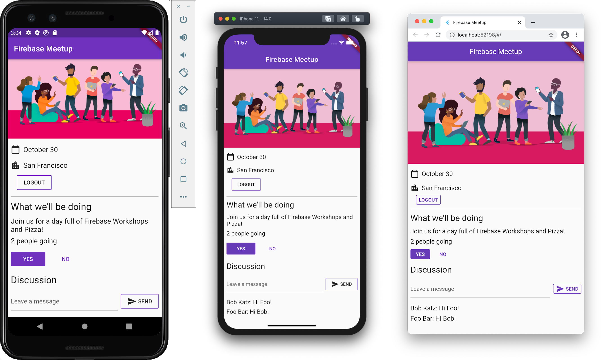

# Get to know Firebase for Flutter

Flutter를 사용하여 **Android, iOS, 웹 및 macOS**에서 **이벤트 RSVP 및 방명록 채팅 앱**을 빌드합니다.

Firebase 인증으로 사용자를 인증하고 Cloud Firestore를 사용하여 데이터를 동기화합니다.

## Preview

codelabs walk-through here:

[![Get to know Firebase for Flutter]](https://firebase.google.com/codelabs/firebase-get-to-know-flutter?continue=https%3A%2F%2Fcodelabs.developers.google.com%2F#8)

## Project goals

This project shows how to:

- Create and set up a Firebase project
- Firebase configuration
- Use the various Firebase email sign-in methods
- Add user sign-in (RSVP)
- Write messages to Cloud Firestore
- Read messages
- Set up basic security rules
- Update Folder Structure

